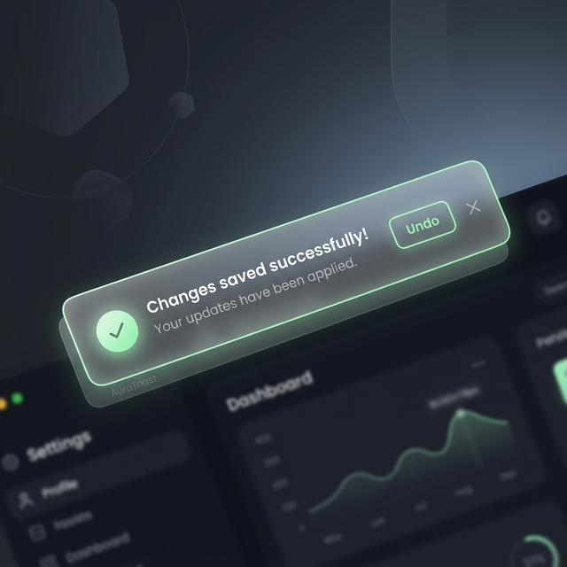

# AuraToast: Premium React Toast & Notification Manager



A high-performance npm package for React toast notifications with a stunning glassmorphism design and a strict "single-toast-at-a-time" constraint.

## Live Demo & Playground

- **Interactive Playground**: [Try it on StackBlitz](https://stackblitz.com/github/damicode18/aura-toast)
- **Live Showcase**: [damicode18.github.io/aura-toast](https://damicode18.github.io/aura-toast/)

## Features

- ✨ **Unique Aesthetic**: Modern glassmorphism design with `backdrop-filter`, glowing borders, and sleek transitions.
- 🚫 **Anti-Clutter**: Enforces a single toast policy. New toasts automatically replace the current one.
- 🛠️ **Framework Agnostic Core**: Core logic is written in TypeScript and can be used with any framework.
- ⚛️ **React Ready**: Comes with first-class React support (`AuraProvider`, `useAuraToast`).
- 🎨 **Highly Customizable**: Uses CSS variables for easy theme adjustments.

## Why AuraToast?

In a world of cluttered notification stacks, **AuraToast** takes a "less is more" approach. It's built for developers who want:
- **Focus**: The single-toast constraint ensures users are never overwhelmed.
- **Aesthetics**: Premium glassmorphism UI that fits modern, high-end applications.
- **Lightweight**: Zero-dependency core with first-class React support.
- **Performance**: Optimized for speed and smooth transitions.

## Installation

```bash
# npm
npm install aura-toast

# yarn
yarn add aura-toast

# pnpm
pnpm add aura-toast

# bun
bun add aura-toast
```

## Quick Start (React)

1. Import the styles and the provider in your main entry file (e.g., `main.tsx` or `App.tsx`):

```tsx
import { AuraProvider } from 'aura-toast';
import 'aura-toast/dist/style.css';

// Wrap your app. Optionally pass stack={true} to allow multiple layered toasts.
// You can also set a default built-in theme for all toasts.
function App() {
  return (
    <AuraProvider stack={true} theme="light">
      <YourApp />
    </AuraProvider>
  );
}
```

## Live Demo

Check out the interactive showcase: [Live Demo Link (GitHub Pages/Vercel)]

> [!TIP]
> **Layout Modes**: AuraToast defaults to a single-toast focused mode. Each new toast elegantly replaces the previous one. If you prefer keeping history on screen, simply pass `stack={true}` to your `<AuraProvider>` to enable a beautiful layered card stack!

2. Trigger toasts using the `auraToast` object:

```tsx
import { auraToast } from 'aura-toast';

function MyComponent() {
  const handleClick = () => {
    // You can pass a string title and a config object:
    auraToast.success('Changes saved successfully!', {
      description: 'Your database has been updated.',
      theme: 'light',
      action: {
        label: 'Undo',
        onClick: () => console.log('Undo clicked'),
      }
    });

    // Or pass just a config object natively (Title is completely optional!)
    auraToast.info({
      description: 'System maintenance scheduled for 3AM.'
    });
  };

  return <button onClick={handleClick}>Save</button>;
}
```

## Vanilla JS & Other Frameworks

AuraToast is built with a **Framework-Agnostic Core**. While we provide React components for convenience, you can easily use it with any framework (Vue, Svelte, Angular) or Vanilla JS by subscribing to the `toastStore`.

### Usage in Vanilla JS

```javascript
import { auraToast, toastStore } from 'aura-toast';
import 'aura-toast/dist/style.css';

// 1. Subscribe to the store to handle rendering
toastStore.subscribe((state) => {
  // state is an array of ToastConfig objects
  if (state.length > 0) {
    console.log('Active toasts:', state);
  } else {
    console.log('No active toasts');
  }
});

// 2. Trigger toasts as usual
auraToast.success({ title: 'Works in Vanilla JS too!' });
```

## API

### `auraToast.success(titleOrConfig, config?)`
### `auraToast.error(titleOrConfig, config?)`
### `auraToast.info(titleOrConfig, config?)`
### `auraToast.warning(titleOrConfig, config?)`
### `auraToast.promise(promise, { loading, success, error }, config?)`
### `auraToast.dismiss(id?)`

#### Configuration Object
| Property | Type | Description |
| --- | --- | --- |
| `title` | ` ReactNode` | The main title of the toast. |
| `description` | `ReactNode` | Smaller subtitle text below the title. |
| `duration` | `number` | Time in ms before auto-dismiss (default: 4000). Set to `0` for **sticky** toasts. |
| `position` | `ToastPosition` | E.g. `'top-right'`, `'bottom-center'`. |
| `action` | `{ label: string, onClick: () => void }` | Optional action button. |
| `glassy` | `boolean` | Enable or disable premium backdrop-blur effects. |
| `theme` | `'dark' \| 'light'` | Use AuraToast's built-in dark or light appearance. |

## Customization

AuraToast ships with built-in `dark` and `light` themes, and you can still override the default styles and typography by providing values for these CSS variables natively in your app or within the `style` prop of a specific toast:

```css
:root {
  --aura-bg: rgba(17, 25, 40, 0.75);
  --aura-success: #10b981;
  --toast-font-size-title: 0.875rem;
  --toast-font-size-desc: 0.75rem;
  /* ... see aura-toast.css for more */
}
```

## License

MIT
